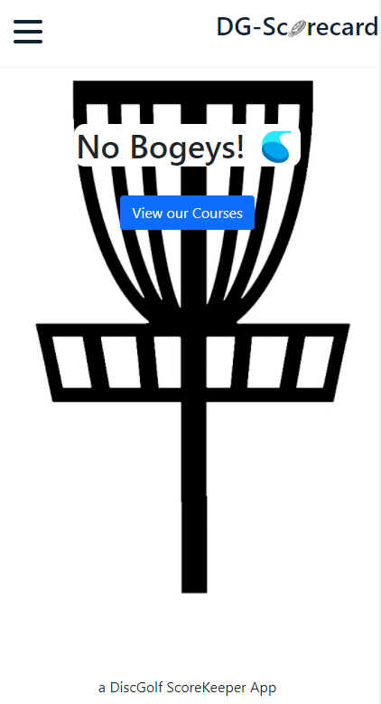

# dg-score-card

## Description
An application in which a user can track their score while playing a round of disc golf. User can save each round to profile and favorite disc golf courses. 

## Usage
To use this application, click on deployed application link below:  
[Disc Golf Scorecard](https://calm-peak-91863.herokuapp.com/)

## Installation
To install this application, click 'install' on top right of browser address bar.

## Technologies
- MongoDB with Mongoose
- Node.js
- Express.js
- React
- Apollo GraphQL
- Apollo Client

## Images
*Preview of application*

## Questions
Reach out on GitHub or contact by email address.  
|       Name       |            Email            |                         GitHub                          |
| :--------------: | :-------------------------: | :-----------------------------------------------------: |
|  Kristin Gaito   |    kngurley25@gmail.com     |     [kngurley25](https://www.github.com/kngurley25)     |
|  Sam Davenport   |   samueldavenport@att.net   | [steadysamwise4](https://www.github.com/steadysamwise4) |
|    Hank Kapka    |     hankkapka@gmail.com     |          [hkapk](https://www.github.com/hkapk)          |
|    Adam Field    |     adamjfield@gmail.com    |     [adamjfield](https://www.github.com/adamjfield)     |
